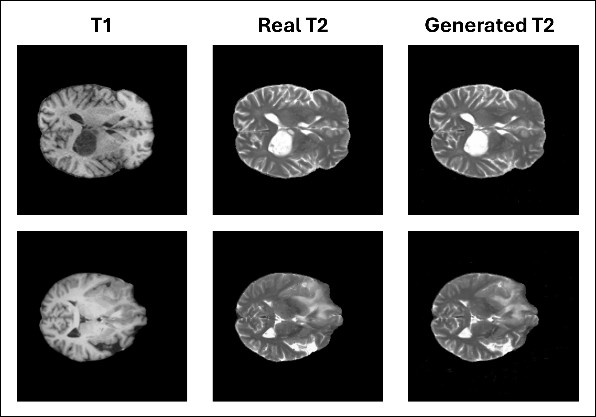

# Brain MRI Modality Translation with the Official pix2pix Framework 

This repository adapts the official pix2pix framework for **paired 2D brain MRI modality translation** on **BraTS2023**, with a primary focus on **T1n → T2w** synthesis.


<p align="center">
  
</p>

<p align="center">
  <em>
    Example paired translation results.
  </em>
</p>


The project converts paired BraTS volumes into cached 2D axial slice pairs, uses a patient-level split to avoid slice leakage, and trains a modified pix2pix model with foreground-aware reconstruction loss and an additional SSIM loss for improved structural fidelity.


---

## Overview

Brain MRI modality translation can be formulated as a paired image-to-image translation problem. In this project:

- **input (`A`)** = T1n axial slice
- **target (`B`)** = T2w axial slice
- **model** = pix2pix
- **generator** = `unet_256`
- **discriminator** = `basic` PatchGAN
- **dataset mode** = custom `bratsnpz`

The codebase is built on top of the official pix2pix repository, with custom additions for:

- BraTS2023 preprocessing
- patient-level train/validation/test splitting
- paired `.npz` dataset loading
- tensor-based checkpoint evaluation
- masked L1 loss
- optional SSIM loss

---

## Main features

- Patient-level split to avoid train/test leakage
- BraTS NIfTI to paired `.npz` slice conversion
- Robust MRI intensity normalisation to `[-1, 1]`
- Custom `bratsnpz` dataset loader for the official pix2pix framework
- Foreground-aware masked L1 loss
- Optional SSIM-enhanced generator loss
- Tensor-based checkpoint selection using:
  - PSNR
  - SSIM
  - MAE

---

## Upstream base

This project is derived from the official repository:

- **Jun-Yan Zhu et al.**
- **pytorch-CycleGAN-and-pix2pix**

Please retain the original licence and upstream attribution included in this repository.

---

## Repository structure

```text
.
├── assets/
│   └── example_translation_results.png
├── data/
│   └── bratsnpz_dataset.py
├── datasets/
│   └── bratsnpz/
│       ├── splits/
│       │   ├── train.txt
│       │   ├── val.txt
│       │   └── test.txt
│       └── slices_npz/
│           └── <patient_id>/
│               ├── slice_000.npz
│               ├── slice_001.npz
│               └── ...
├── models/
│   └── pix2pix_model.py
├── scripts_brats/
│   ├── preprocess_brats_to_npz.py
│   ├── split_patients.py
│   ├── tensor_checkpoint_evaluator.py
│   └── ...
├── train.py
├── test.py
├── README.md
└── LICENSE
```

---

## Data

This repository does **not** include BraTS2023 data, preprocessed slice caches, checkpoints, or generated results.

### Expected raw BraTS2023 structure

```text
data/BraTS2023/<patient_id>/
    <patient_id>-t1n.nii.gz
    <patient_id>-t1c.nii.gz
    <patient_id>-t2f.nii.gz
    <patient_id>-t2w.nii.gz
    <patient_id>-seg.nii.gz
```

Example:

```text
data/BraTS2023/BraTS-GLI-00000-000/
    BraTS-GLI-00000-000-t1n.nii.gz
    BraTS-GLI-00000-000-t2w.nii.gz
    ...
```

### Expected processed dataset structure

```text
datasets/bratsnpz/
    splits/
        train.txt
        val.txt
        test.txt
    slices_npz/
        <patient_id>/
            slice_000.npz
            slice_001.npz
            ...
```

Each `.npz` file stores paired slices, typically:

- `A`: source slice (T1n)
- `B`: target slice (T2w)
- optionally `z`: slice index

---

## Patient-level split

The train/validation/test split is generated at the **patient level**, not the slice level.

This is essential for medical imaging because adjacent slices from the same subject are highly correlated. Slice-level splitting can leak anatomy across partitions and produce overly optimistic metrics.

---

## Environment

This project has been developed and tested primarily on:

- **OS:** Windows
- **Python:** 3.10
- **Environment:** Conda
- **GPU:** NVIDIA RTX 3080 Ti

Core dependencies include:

- PyTorch
- torchvision
- numpy
- scikit-image
- Pillow
- nibabel
- dominate

Install packages according to your local environment and script imports.

---

## Step 1: generate patient splits

Example PowerShell command:

```powershell
python .\scripts_brats\split_patients.py `
  --raw_root .\data\BraTS2023 `
  --out_dir .\datasets\bratsnpz\splits `
  --train_ratio 0.7 `
  --val_ratio 0.15 `
  --test_ratio 0.15 `
  --seed 42
```

This creates:

- `train.txt`
- `val.txt`
- `test.txt`

---

## Step 2: preprocess BraTS NIfTI volumes to `.npz` slices

Example PowerShell command:

```powershell
python .\scripts_brats\preprocess_brats_to_npz.py `
  --raw_root .\data\BraTS2023 `
  --out_root .\datasets\bratsnpz\slices_npz `
  --height 256 `
  --width 256 `
  --z_start 0.20 `
  --z_end 0.80
```

Optional overwrite behaviour can be added if supported by your local script version.

---

## Training

### Baseline pix2pix settings

- **model**: `pix2pix`
- **generator**: `unet_256`
- **discriminator**: `basic` PatchGAN
- **input channels**: `1`
- **output channels**: `1`
- **direction**: `AtoB`
- **dataset mode**: `bratsnpz`

### Best-performing configuration in this project

The strongest official-repo variant used:

- **instance normalisation**
- **LSGAN**
- **masked L1 loss**
- **SSIM loss**
- **batch size 4**
- **patient-level split**
- **tensor-based checkpoint selection**

Example training command:

```powershell
python .\train.py `
  --dataroot .\datasets\bratsnpz `
  --dataset_mode bratsnpz `
  --model pix2pix `
  --name brats_B2_maskedL1_SSIM_bs4_inst_lsgan `
  --direction AtoB `
  --input_nc 1 `
  --output_nc 1 `
  --netG unet_256 `
  --netD basic `
  --norm instance `
  --gan_mode lsgan `
  --lambda_L1 100 `
  --use_masked_l1 `
  --brain_mask_threshold -0.99 `
  --use_ssim_loss `
  --lambda_SSIM 5.0 `
  --ssim_window_size 11 `
  --preprocess none `
  --load_size 256 `
  --crop_size 256 `
  --batch_size 4 `
  --num_threads 0 `
  --no_flip `
  --save_epoch_freq 1 `
  --n_epochs 10 `
  --n_epochs_decay 10
```

---

## Evaluation

### Why tensor-based evaluation is used

Evaluation is performed directly on model tensors rather than exported PNGs in order to avoid:

- 8-bit quantisation
- HTML/export artefacts
- filename collision issues
- inconsistencies caused by saved image formatting

### Metrics

The tensor-based checkpoint evaluator reports:

- **PSNR**
- **SSIM**
- **MAE**

### Validation ranking across checkpoints

Example:

```powershell
python .\scripts_brats\tensor_checkpoint_evaluator.py `
  --epochs 1,2,3,4,5,6,7,8,9,10,11,12,13,14,15,16,17,18,19,20,latest `
  --summary_csv .\results\brats_B2_maskedL1_SSIM_bs4_inst_lsgan\tensor_val_summary.csv `
  --per_sample_csv .\results\brats_B2_maskedL1_SSIM_bs4_inst_lsgan\tensor_val_per_sample.csv `
  --dataroot .\datasets\bratsnpz `
  --dataset_mode bratsnpz `
  --model pix2pix `
  --name brats_B2_maskedL1_SSIM_bs4_inst_lsgan `
  --direction AtoB `
  --input_nc 1 `
  --output_nc 1 `
  --netG unet_256 `
  --netD basic `
  --norm instance `
  --preprocess none `
  --load_size 256 `
  --crop_size 256 `
  --phase val `
  --eval
```

### Final test evaluation for a selected checkpoint

Example for epoch 7:

```powershell
python .\scripts_brats\tensor_checkpoint_evaluator.py `
  --epochs 7 `
  --summary_csv .\results\brats_B2_maskedL1_SSIM_bs4_inst_lsgan\tensor_test_epoch7_summary.csv `
  --per_sample_csv .\results\brats_B2_maskedL1_SSIM_bs4_inst_lsgan\tensor_test_epoch7_per_sample.csv `
  --dataroot .\datasets\bratsnpz `
  --dataset_mode bratsnpz `
  --model pix2pix `
  --name brats_B2_maskedL1_SSIM_bs4_inst_lsgan `
  --direction AtoB `
  --input_nc 1 `
  --output_nc 1 `
  --netG unet_256 `
  --netD basic `
  --norm instance `
  --preprocess none `
  --load_size 256 `
  --crop_size 256 `
  --phase test `
  --eval
```

---

## Acknowledgements

This project is based on the official **pytorch-CycleGAN-and-pix2pix** implementation by Jun-Yan Zhu and collaborators, adapted here for paired 2D brain MRI modality translation on BraTS2023.

---

## Licence

Please see the original `LICENSE` file included in this repository and preserve upstream attribution.
